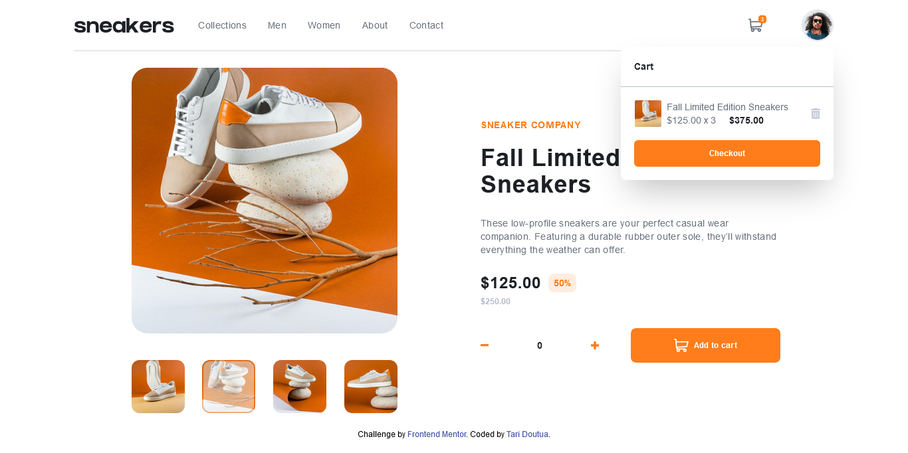

# Frontend Mentor - E-commerce product page solution

This is a solution to the [E-commerce product page challenge on Frontend Mentor](https://www.frontendmentor.io/challenges/ecommerce-product-page-UPsZ9MJp6). Frontend Mentor challenges help you improve your coding skills by building realistic projects.

## Table of contents

- [Overview](#overview)
  - [The challenge](#the-challenge)
  - [Screenshot](#screenshot)
  - [Links](#links)
- [My process](#my-process)
  - [Built with](#built-with)
  - [What I learned](#what-i-learned)
  - [Continued development](#continued-development)
  - [Useful resources](#useful-resources)
- [Author](#author)

## Overview

### The challenge

Users should be able to:

- View the optimal layout for the site depending on their device's screen size
- See hover states for all interactive elements on the page
- Open a lightbox gallery by clicking on the large product image
- Switch the large product image by clicking on the small thumbnail images
- Add items to the cart
- View the cart and remove items from it

### Screenshot

### Links

- Solution URL: [Add solution URL here](https://your-solution-url.com)
- Live Site URL: [Add live site URL here](https://your-live-site-url.com)

## My process

### Built with

- Semantic HTML5 markup
- Flexbox
- Mobile-first workflow
- Tailwindcss
- Vanilla Javascript
- ES7 and above

### What I learned

I learned how to use some of the latest ES7 and above features in the project, latest features like some array methods, some browser objects methods and as well array and object disstructuring methods. The challenge gave me more knowledge on how to do things in sort of a dynamic way instead of hard coding stuffs. And I tried as much as possible to keep my code clean, neat, and easy to read.

### Continued development

I think I will continue development in these aspects and more, I don't just remember all lol. Becouse there are a lot in javascript to learn, so I can't remember all for now.

- More string and array methods
- Browser APIs
- Dynamically coding stuffs
- Moving forward to learning react

### Useful resources

- [ChatGPT](https://chat.openai.com) - To be sincere, using the 'findIndex()' method was really giving me a bit issues so I ask chat-gpt for little help and it was just to easy lol. Though I didn't go to google first, because I felt chat-gpt will be more of help by giving it better prompt, so I would recommend beginners(or should I call myself an intermidiate programmer lol, I don't know, I will just stick with beginner for now) like me to sick help from chat-gpt, because you can give it what you want and with expectation of getting what you give it. 

## Author

- Frontend Mentor - [@T-tech26](https://www.frontendmentor.io/profile/yourusername)
- LinkedIn - [@tariladei-doutua](https://www.your-site.com)
- Twitter - [@TariDoutua](https://www.twitter.com/TariDoutua)